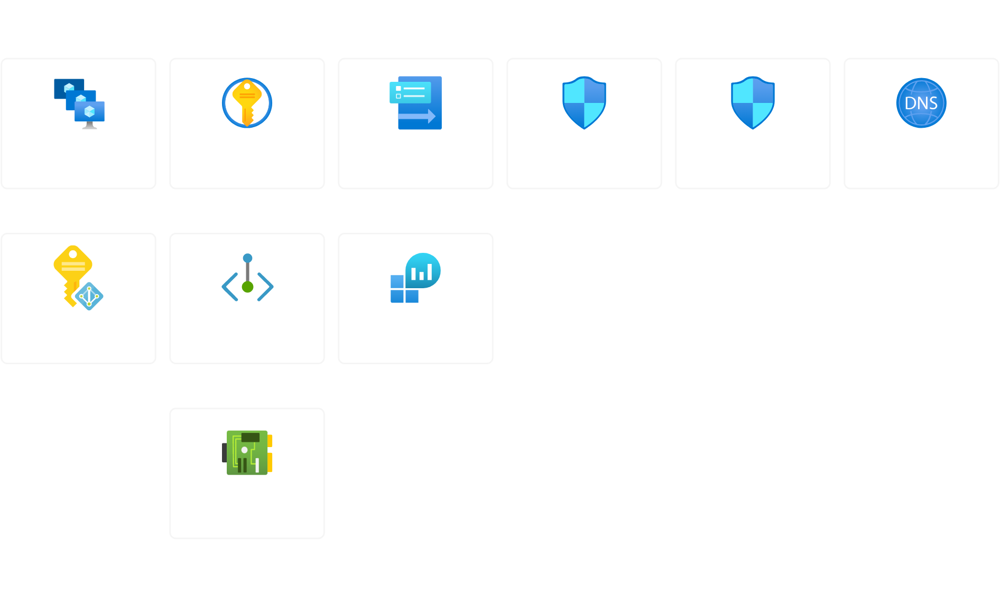
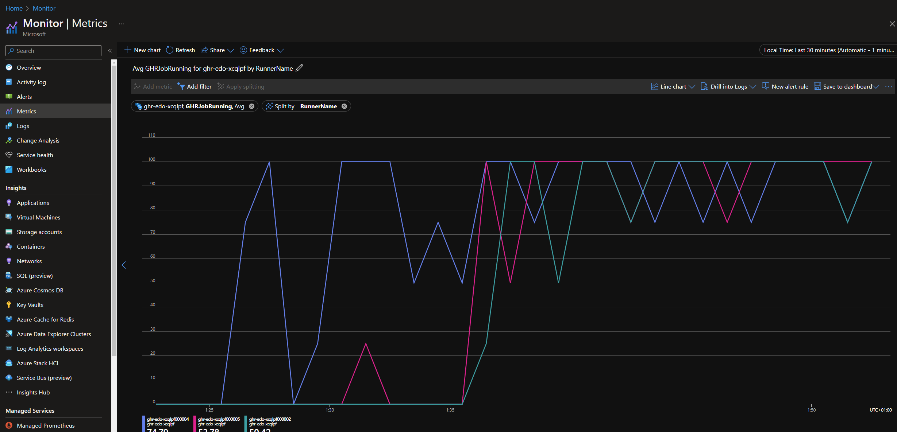
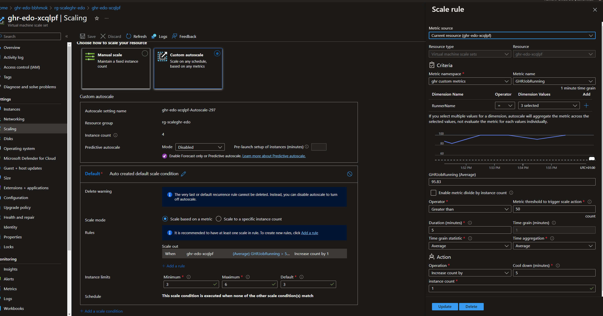

# azure-vmss-custom-metrics

## Introduction

In this article I explore utilising a custom metric to automatically scale the instances in an Azure Virtual Machine Scale Set (VMSS).
The use case I had in mind here was a simple way to scale self-hosted GitHub runners in response to how many did not have a job assigned to them.
As in this case the CPU utilisation and other standard metrics would not be useful, I decided to create a custom metric to track the number of runners without a job assigned.
In the scope of this article the exact use case was not of primary concern here, but rather the process of creating a custom metric and using it to scale a VMSS.

## Infrastructure set up

The first step is to set up a basic environment in a resource group with the following resources:

- Virtual Network, subnets and network security groups
- Key Vault (with Private Endpoint and DNS zone) for the VMSS secrets
- Log Analytics Workspace
- Virtual Machine Scale Set (with a managed identity)
- Data collection Rule to capture syslog and standard metrics

this is shown in the diagram below:



## Populating the custom metric

Azure Monitor supplies a [REST endpoint](https://learn.microsoft.com/en-us/azure/azure-monitor/essentials/metrics-store-custom-rest-api) allowing the population of custom metrics.
Before we can populate a REST request we need to capture our metric value on the VMSS instance, in this simple use case we achieve this by checking for the presence of a file called
`RUNNER_JOB_IN_PROGRESS` which is created when the runner starts a job and removed when it completes.

With this defined we can then run this [script](../azure-vmss-custom-metrics/resources/metrics.sh) (as a cron job) on the VMSS instances every minute.
The script is in three key parts

1. get the instance resource id, location and a token from the metadata service

```bash
LOCATION=$(echo $IMDS | jq -r .compute.location)
RESOURCEID=$(echo $IMDS | jq -r .compute.resourceId | sed 's|/virtualMachines/.*||')
TOKEN=$(curl -s 'http://169.254.169.254/metadata/identity/oauth2/token?api-version=2018-02-01&resource=https%3A%2F%2Fmonitoring.azure.com%2F' -H Metadata:true -s | jq -r .access_token)
```

2. check for the presence of the file and set the metric value accordingly

```bash
if [ -f /home/$username/RUNNER_JOB_IN_PROGRESS ]; then
    post_metrics 100
else
    post_metrics 0
fi
```

3. post the metric value to the REST endpoint

```bash
function post_metrics() {
    http_response=$(curl -sX POST https://$LOCATION.monitoring.azure.com$RESOURCEID/metrics -H "Content-Type: application/json" -H "Authorization: Bearer $TOKEN" --data-binary @- <<EOF
    { 
        "time": "$(date -u +"%Y-%m-%dT%H:%M:%SZ")", 
        "data": { 
            "baseData": { 
                "metric": "$METRICNAME", 
                "namespace": "$WORKSPACE", 
                "dimNames": [ 
                  "RunnerName"
                ], 
                "series": [ 
                { 
                    "dimValues": [ 
                      "$RUNNERNAME"
                    ], 
                    "min": $1, 
                    "max": $1, 
                    "sum": $1, 
                    "count": 1
                } 
                ] 
            } 
        } 
    }
EOF
    )
}
```

I then added this script to the VMSS instances as a cron job with a custom_data script:

```bash
# Add metrics processing CRON job
sudo ln -s /home/${username}/scripts/metrics.sh /usr/bin/metrics
echo "*/1 * * * * root metrics" | sudo tee -a /etc/cron.d/metrics > /dev/null
```

## Validating the metrics

With the script running we can then observe the metric in the Azure Monitor section of the portal:



In this graph you can see that there is a custom metric called `GHRJobRunning` that we are observing with a scope of the VMSS (`ghr-edo-xcqlpf`) 
and I have split it by the dimension of the individual VMSS instances (`RunnerName`).

## Scaling the VMSS

With the metric being captured we can now use it to scale the VMSS, to do this we need to create a [scale rule](https://learn.microsoft.com/en-us/azure/virtual-machine-scale-sets/virtual-machine-scale-sets-autoscale-overview) 
under the "Scaling" blade of teh VMSS resource in the Azure portal:



In this screenshot we can see we have chosen "Custom autoscale" and then selected a custom metric to base that on, in this case our `GHRJobRunning` metric. 
We then set the "Instance limits" to 3 and 6, this means that the VMSS will scale between 3 and 6 instances based on the metric value starting off with the default 3. 
On the right hand side of the screenshot we can set the metric threshold so that when this is exceeded the VMSS will spawn a new instance. We can also set the
time to monitor the metric over when making this decision and how long to cool down for (i.e. make no scaling decisions) after a scale event.

## Conclusion

Azure Monitor custom metrics provide a useful way to control the scalling of a Virtual Machine Scale Set with a metric of your choice. With this 
approach you can scale up and down in response to demand without having to define lots of control logic yourself you can simply publish the 
metric and then define scaling rules that respond to it.
